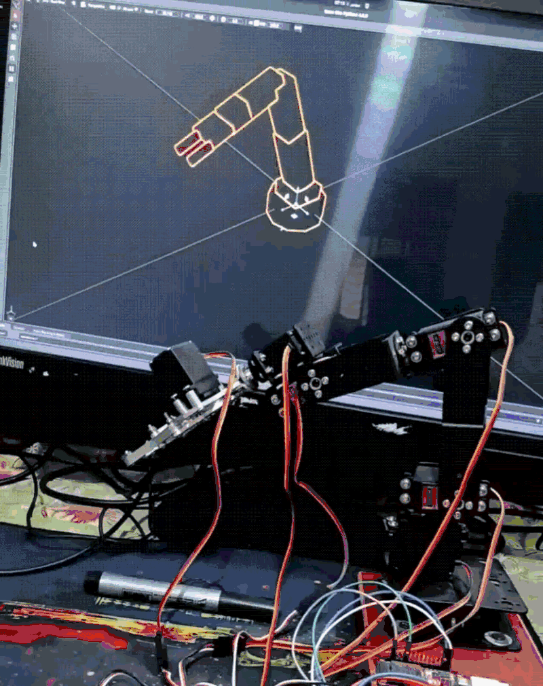
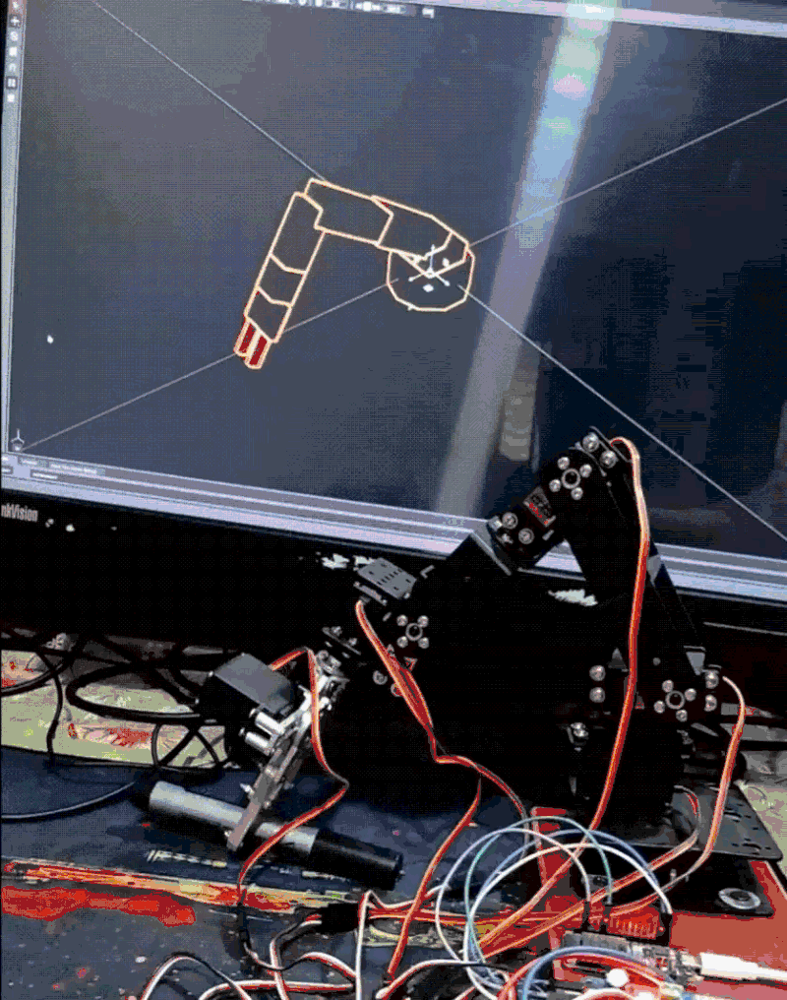

# Small Hammer ROS 2 Digital Twin

ROS 2 description, ESP32 control, and NVIDIA Isaac Sim digital twin for the Small Hammer 6-DOF robotic arm.

The project models the physical arm in URDF/Xacro, controls the real servos through an ESP32 and PCA9685, and mirrors the arm's joint movements inside NVIDIA Isaac Sim.

The goal of the project was not to create a perfect 1:1 mechanical replica, but to correctly map the physical robot joints to the simulated joints and have both arms move in the same directions.

NVIDIA Isaac Sim 4.5 was used for the simulation.

---

## Digital Twin

### Downward Motion

### Upward Motion

The physical arm sends servo commands through the ESP32 while the same joint commands are forwarded to Isaac Sim over TCP.

The simulated arm does not perfectly match the physical home pose because the real servo positions and mechanical mounting are not perfectly aligned to exact 90-degree angles. The simulated model uses ideal joint positions, but the joint directions and movement correspond to the physical arm.

---

## Features

- 6-DOF Small Hammer robotic arm model
- URDF/Xacro robot description
- ESP32 servo control
- PCA9685 servo driver
- Physical servo-to-URDF joint mapping
- NVIDIA Isaac Sim 4.5 support
- Real-time physical arm to simulation communication
- TCP communication between ESP32 and Isaac Sim
- JSON-based joint commands
- Independent gripper control
- Digital twin visualization

---

## Hardware

- Small Hammer 6-DOF Robot Arm
- MG996R Servos
- ESP32
- PCA9685 16-channel PWM Servo Driver

---

## Joint Mapping

The physical servo channels are mapped to the robot joints as follows:

| Joint | Function | ESP32 / PCA9685 Channel |
|------|----------|--------------------------|
| J1 | Base | CH6 |
| J2 | Shoulder | CH1 |
| J3 | Elbow | CH2 |
| J4 | Wrist Pitch | CH3 |
| J5 | Wrist Roll | CH4 |
| J6 | Gripper | CH5 |

The physical servo neutral position is approximately `90°`.

In the Isaac Sim model, the corresponding revolute joint home position is `0 rad`.

---

